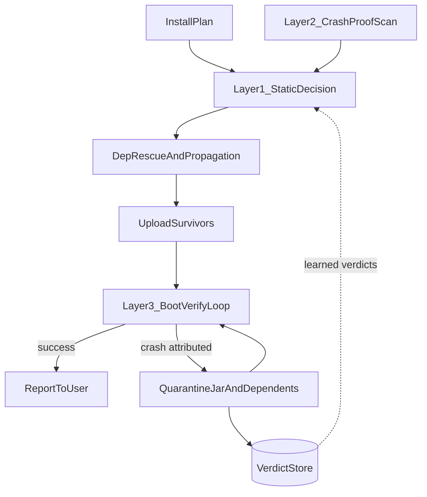

# Mod Detection Three-Layer Overhaul

Status: planned, not started. Context: designed 2026-07-17 against eval report at
`/tmp/modpack-corpus/results/REPORT.md` (25 packs, 3794 labeled mods, combined acc 98.8%, FP=32, FN=12).

## Goal

Replace the tuned-heuristic client-mod classifier with a design where every layer is either
deterministic or self-correcting. Highest priority: never drop a server-needed mod; guarantee the
server boots; zero extra user interaction.

Rationale (from design discussion):

- Current ground truth (Modrinth labels) is noisy, so tuning static heuristics against it oscillates.
- The weak-heuristic tier in `utility/mod_inspector.js` (mixin thresholds, GUI supers, CP mentions)
  is overfit to specific mods (Fusion, Blur, Kiwi, BiblioCraft) and is the source of churn.
- Fabric/Quilt `environment: client` mods are filtered by the loader on dedicated servers, so
  misclassifying them is nearly free; the dangerous loader is Forge (every `@Mod` class is
  constructed server-side), worst in legacy 1.7-1.12 jars with no metadata.
- The real correctness oracle is "the server boots" — verify empirically, feed results back.

## Decision precedence (Layer 1, final)

1. config blocklist → skip (never rescued)
2. config allowlist + `data/server_side_overrides.json` (known Modrinth mislabels: Pam's, VanillaFix, ...) → install
3. learned crash verdict from VerdictStore (sha1) → skip, non-rescuable
4. provider `required`/`optional` → install
5. explicit self-declared client metadata (fabric/quilt `environment: client`, `clientSideOnly`,
   `@Mod(clientSideOnly=true)`, cross-loader env) → skip, non-rescuable
6. curated client-side list match (`data/client_side_mods.json`) → skip, rescuable
7. provider `unsupported` → skip, rescuable
8. Layer 2 crash-proof reachability hit → skip, rescuable
9. default → install

Dependency rescue fixpoint and client-chain propagation in `utility/modpack_install.js` stay as-is.

## Phase 0 — Freeze ground truth

- Hand-triage the ~44 FP/FN rows from the eval report into a checked-in `scripts/eval_overrides.json`
  (sha1/modId → correct label). Confirmed Modrinth mislabels also seed `data/server_side_overrides.json`.
- `scripts/eval_pack_corpus.js`: apply overrides on top of Modrinth labels so all later phases are
  measured against stable truth.

## Phase 1 — Shrink the static tier

- New `data/client_side_mods.json`: curated client-only mod IDs / filename prefixes, seeded from
  ServerPackCreator's default clientside-mods list (covers Blur, Custom Main Menu, ReAuth,
  OldJavaWarning, etc. — the legacy-Forge long tail the bytecode heuristics chase).
- `utility/mod_inspector.js`: keep only explicit signals (fabric/quilt env, `clientSideOnly`,
  `@Mod` annotation, cross-loader env). Delete the weak tier: mixin-count thresholds,
  `dep-side-client`, `all-deps-client`, `client-entrypoints`, GUI-super set,
  `mod-class-client-ref`/`client-cp`, `mentionsClient`, and the `forge-mod-no-client-ref` Pam rescue
  (replaced by `server_side_overrides.json`). `extractModDeps` unchanged.
- `isClientOnlyMod` reimplemented as the precedence table above; bump `CACHE_VERSION`.
- Update `tests/mod_inspector.test.js`; run eval to confirm no regression vs golden labels.

## Phase 2 — Crash-proof static analysis (Layer 2)

- `utility/crash_risk.js`: add Forge/NeoForge roots — `@Mod`-annotated classes are constructed on
  dedicated servers, so run `constructionEagerRefs` from them (generalizes the deleted `refsClient`
  check with the real oracle). Legacy 1.7-1.12 jars keep working via the existing
  `net/minecraft/client/` prefix fallback since SRG preserves class names; no Mojang mappings needed there.
- Promote from warning-only to skip signal at precedence slot 8 (provider null/unsupported only,
  rescuable). Provider required/optional keeps the current warn-only behavior.
- Cache scan results by sha1 in the VerdictStore.

## Phase 3 — Boot-verify loop (Layer 3)

- New panel APIs in `utility/server_functions.js`: `getFileContents` (GET `files/contents`) and
  `renameServerFiles` (PUT `files/rename`) for reading crash reports and quarantining jars.
- New `utility/crash_attribution.js`: crash report + console tail + install-time mod index →
  offending jar(s). Index built during `installFilePlan` (modId → jar, mixin-config name → jar,
  package prefix → jar; nearly free since every classfile is already parsed). Handles Forge
  `Mod File:` / `LoadingFailedException` lines, Fabric `Mod 'X' (modid)` / mixin-config errors,
  stack-frame package matching, and missing-dependency errors (map back to a quarantined dep →
  quarantine the dependents too).
- New `utility/boot_verify.js`: start server → attach `utility/pterodactyl_websocket.js`
  `consoleLine`/`powerStateChange` → success on `Done (...s)!`, failure on crash/offline. On failure:
  read newest `crash-reports/*.txt`, attribute, move jar(s) + dependents to `mods-disabled/`, write
  learned verdict, restart. Cap at ~5 attempts plus a time budget; unattributable crash ends the loop
  with the console tail in the report (bisection deferred to a follow-up). Config block `boot_verify`
  in `config.json` (enabled, max_attempts, success_timeout_ms).
- Wire into `runInstallation` in `commands/ptero/install_modpack.js` after file placement, for all
  install paths. Progress updates stay best-effort (`editReply().catch()`) since the loop can outlive
  the 15-min interaction token; final outcome always goes to logs. Completion message lists
  quarantined mods and drops the "report to admin on crash" reminder when verification passed.

## Phase 4 — Verdict store flywheel

- New `utility/verdict_store.js` replacing the raw `mod_inspector_cache.json` handling: sha1-keyed
  records `{ inspection, learnedVerdict, source, modId, timestamp }`. Boot-loop crash attributions
  write `learnedVerdict: "crashes-server"`; Layer 1 consults it at slot 3. Migrate/discard the old
  cache file.

## Phase 5 — Eval + tests

- `scripts/eval_pack_corpus.js`: score the new precedence pipeline (including curated lists and
  Layer 2 skips) against golden labels; report per-slot skip sources.
- New tests: `crash_attribution` against real crash-report fixtures (Forge + Fabric), `boot_verify`
  state machine with synthetic console streams, verdict store round-trip. Update
  `tests/modpack_install.test.js` / `tests/install_modpack.test.js` for the new flow.
- Full run: `npm test`, `npm run lint`, then `node scripts/eval_pack_corpus.js` to produce the
  before/after accuracy report.

## Risks / notes

- Removing the weak tier shifts some skips to "install + boot-verify mops up" — intended; a kept
  harmless client mod costs RAM, not correctness.
- First boot of a big pack can take minutes (worldgen); success timeout must be generous (~10 min)
  while crash detection stays fast (loader failures die in 30-90 s).
- ServerPackCreator list is GPL-licensed project data; fine for this private bot, worth a
  source-attribution comment in the JSON.

## Todo checklist

- [x] Phase 0: triage eval FP/FN rows into `scripts/eval_overrides.json` and `data/server_side_overrides.json`; wire overrides into eval harness
- [x] Phase 1: create `data/client_side_mods.json` seeded from ServerPackCreator clientside-mods list
- [x] Phase 1: strip `mod_inspector.js` to explicit signals; reimplement `isClientOnlyMod` as precedence table; update tests; verify eval parity
- [x] Phase 2: extend `crash_risk.js` with Forge `@Mod` construction roots; promote reachability hits to rescuable skip signal
- [x] Phase 3: add `getFileContents` and `renameServerFiles` to `server_functions.js`
- [x] Phase 3: build `crash_attribution.js` with install-time mod index (modId/mixin/package → jar) and Forge/Fabric crash parsers
- [x] Phase 3: build `boot_verify.js` loop (start, console watch, quarantine, retry) and wire into `runInstallation` with config gating
- [x] Phase 4: create `verdict_store.js` (sha1-keyed, learned verdicts) and migrate mod_inspector cache; consult in Layer 1
- [x] Phase 5: add fixtures/tests for attribution, boot loop, verdict store; update install tests; run `npm test`, lint, and eval corpus for final report
